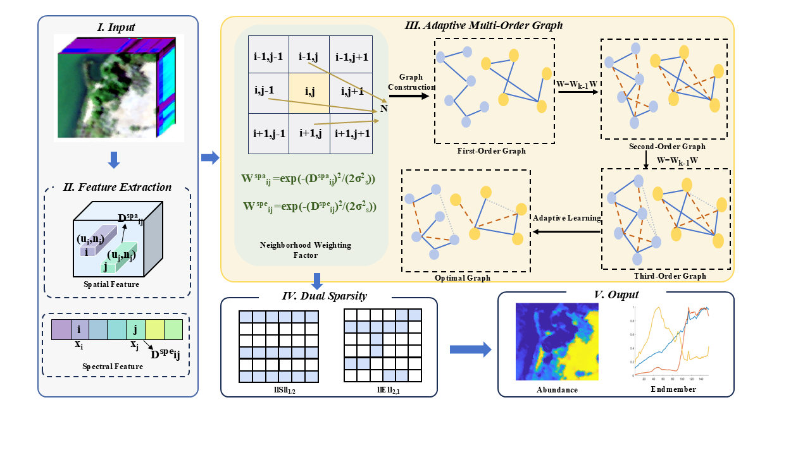

# MOGNMF

The code in this toolbox implements "Adaptive Multi-Order Graph Regularized NMF with Dual Sparsity for Hyperspectral Unmixing" by <i>H. Chen, L. Liu, X. Xiu, W. Liu</i>.

### Testing
Directly run demo.m for reproduction.

### Citation
Please give credits to this paper if this code is useful and helpful for your research.

     @article{zhang2023structured,
      title     = {Adaptive Multi-Order Graph Regularized NMF With Dual Sparsity for Hyperspectral Unmixing},
      author    = {Chen, Hui and Liu, Liangyu and Xiu, Xianchao and Liu, Wanquan},
      journal   = {IEEE Journal of Selected Topics in Applied Earth Observations and Remote Sensing},
      year      = {2025},
      volume    = {18},
      number    = {},
      pages     = {22121-22136},
      publisher = {IEEE}
     }
